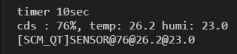

# 프로젝트 개요
QT 프로그램과 STM32F411RE를 사용하여 Raspberry Pi 7" Touch Display에 Wallpad를 만들어보는 프로젝트입니다.

# 프로젝트 목표
- Raspberry Pi와 7" Touch Display를 사용하여 QT를 활용한 Wallpad 구현.
- STM32F411RE를 사용하여 센서 값 전달.
- ESP8266을 사용한 데이터 전송.

<p align="center">

</p>

# Hardware 구성
- Raspberry Pi와 7" Touch Display는 Flexible Flat Cable을 사용하여 연결.
- Raspberry Pi와 Webcam은 USB로 연결
- STM32F411RE와 DHT11, LED, ESP8266, CDS센서(ADC)는 GPIO로 연결.
- Raspberry Pi와 ESP8266은 상호간 WIFI socket으로로 통신.

<p align="center">


</p>

---

# Software 구성
## DHT11 센서 구현
### Data Start Signal
- DHT11 센서는 Signal을 전송하기 위해서 Low값을 18ms로 유지하고 High 값으로 20~40us 유지해야 함.
- 해당 시그널은 MCU의 시그널로 전송해야 하므로 OUTPUT으로 진행한다. 이후 INPUT으로 변경하여 데이터를 전송 받음.
- DHT11 센서에서는 LOW값을 80us로 유지한 후 High값을 80us로 유지하 Low값을 받으면 Data 전송이 시작됨.

<p align="center">

</p>

- DHT11 Sensor의 경우 delay를 사용하지 않고 값의 변화를 while문을 사용하여 구현.
```C
while (HAL_GPIO_ReadPin(DHT11_GPIO_Port, DHT11_Pin) == GPIO_PIN_SET);
while (HAL_GPIO_ReadPin(DHT11_GPIO_Port, DHT11_Pin) == GPIO_PIN_RESET);
while (HAL_GPIO_ReadPin(DHT11_GPIO_Port, DHT11_Pin) == GPIO_PIN_SET);
```

- delay 함수의 경우 HAL_Delay 함수를 사용하지 않고 Timer를 사용하여 구현.
```C
void delay_us(uint16_t us) {
    __HAL_TIM_SET_COUNTER(&htim1, 0); // 타이머 카운터 초기화
    while (__HAL_TIM_GET_COUNTER(&htim1) < us); // 원하는 시간만큼 대기
}
```

----

### Low and High Signal
- bit Data가 0인 경우 High값을 26~28us를 유지한 후 Low값으로 변경하여 다음 bit Signal로 넘어간다.
- bit Data가 1인 경우 High Signal을 70us를 유지한 후 Low값으로 변경하여 다음 bit Signal로 넘어간다.

<p align="center">


</p>

- bit 연산을 통한 Data값 구현

```C
for (int byteIndex = 0; byteIndex < 5; byteIndex++) {
    uint8_t rx_data = 0;
    for (int bitIndex = 0; bitIndex < 8; bitIndex++) {
        while (HAL_GPIO_ReadPin(DHT11_GPIO_Port, DHT11_Pin) == GPIO_PIN_RESET); // Low 신호 대기
        delay_us(40); // 40µs 대기 후 데이터 확인
        rx_data <<= 1;
        if (HAL_GPIO_ReadPin(DHT11_GPIO_Port, DHT11_Pin) == GPIO_PIN_SET) {
            rx_data |= 1;
        }
        while (HAL_GPIO_ReadPin(DHT11_GPIO_Port, DHT11_Pin) == GPIO_PIN_SET); // High 신호 종료 대기
    }
    data[byteIndex] = rx_data; // 바이트 저장
}
```

---

### Data 값을 Oscilloscope를 통해 확인
- Data는 8bit씩 차례대로 총 40bit가 전송됨.
    - 1st 8bit : 습도의 정수부
    - 2nd 8bit : 습도의 실수부
    - 3nd 8bit : 온도의 정수부
    - 4th 8bit : 온도의 실수부
    - 5th 8bit : CheckSum (1~4의 bit를 모두 더한 값)

<p align="left">

</ㅔ>

- 위의 Data 값을 확인하기 위해 Oscilloscope를 통하여 확인하면 아래와 같다.

<p align="center">

</p>

- 위의 Data값을 모두 더해 CheckSum을 확인하면 아래와 같이 나온다.
```
CheckSum 계산
00010111
00000000
00011010
00000010
=>00110011 
```

<p align="center">

</p>

- CheckSum Data를 통하여 센서 오류를 확인
- data[] 값은 습도와 온도 data

```C
uint8_t checksum = data[0] + data[1] + data[2] + data[3];
if ((checksum & 0xFF) != data[4]) {
    dht11_data.status = 1; // 체크섬 오류
    return dht11_data;
}
```

---

## 작동 이미지 및및 영상
### 서버와 STM32F411RE와 통신
- STM32에서 전송된 CDS 센서 값과 DHT11 값을 "@"로 구분하여 전송.
- Raspberry Pi에서는 LED를 켜기 위한 명령어 전달 (이후 Light On/Off에서 소개)

<p align="center">

</p>

### Wallpad Starting
- Shellscript를 사용하여 서버와 Wallpad가 동시에 켜지도록 구성
    - 서버는 Background에서 동작되도록 구현
- Shellscript를 사용하여 Desktop에 아이콘 생성성
- 아래 코드블록 참고

```shell
#!/bin/bash

echo "Starting IoT Server..."
/home/pi/iot_server/iot_server 5000 &

echo "Waiting for server to be ready..."
while ! nc -z localhost 5000; do
    sleep 1
done
echo "Server is ready!"

echo "Starting Wallpad..."
export DISPLAY=:0
/home/pi/Project_Wallped/Project_Wallped
```

```shell
[Desktop Entry]
Type=Application
Encoding=UTF-8
Name=Wallpad
Path=/home/pi/
Exec=sh wallpad.sh
Terminal=true
Icon=/home/pi/Image/wallpad.png
```

<p align="center">

</p>

### Webcam Starting
- 현관문에 사람이 찾아왔을 때 터치 스크린 버튼을 눌러 카메라 송출.
- 다른 곳에 카메라를 달아 통신으로 화면 송출할 수 있도록 변경 필요.

<p align="center">

</p>

### Light On/Off
- 내부의 전등을 원격으로 작동시키기 위해 socket으로 메세지 전송
- LAMP@ON으로 전등 ON, LAMP@OFF로 전등 OFF

<p align="center">

</p>

### Sensor graph Display
- STM32에서 받아온 sensor 정보를 Raspberry Pi로 전달하여 이를 graph로 표현.
- 10초마다 data를 전송. '@'로 data를 구분하여 graph를 그림.

<p align="center">

</p>

- 증기에 노출 및 빛 변화에 따른 그래프 변화

<p align="center">

</p>
